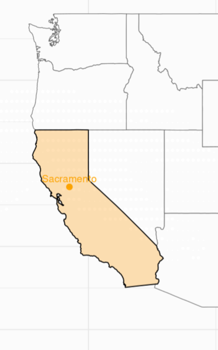
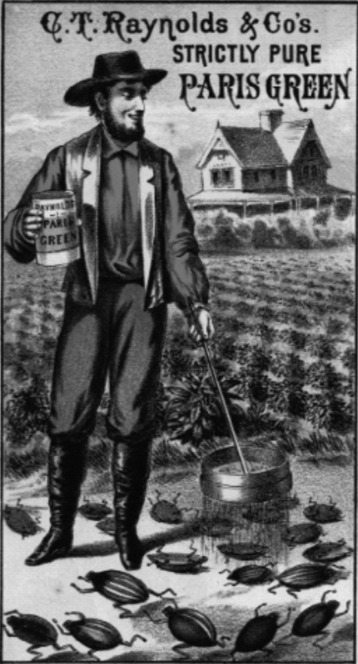
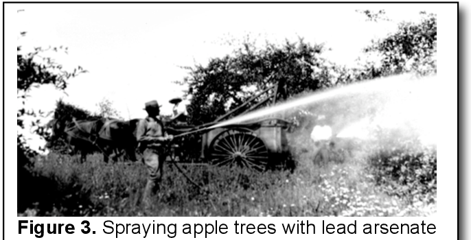
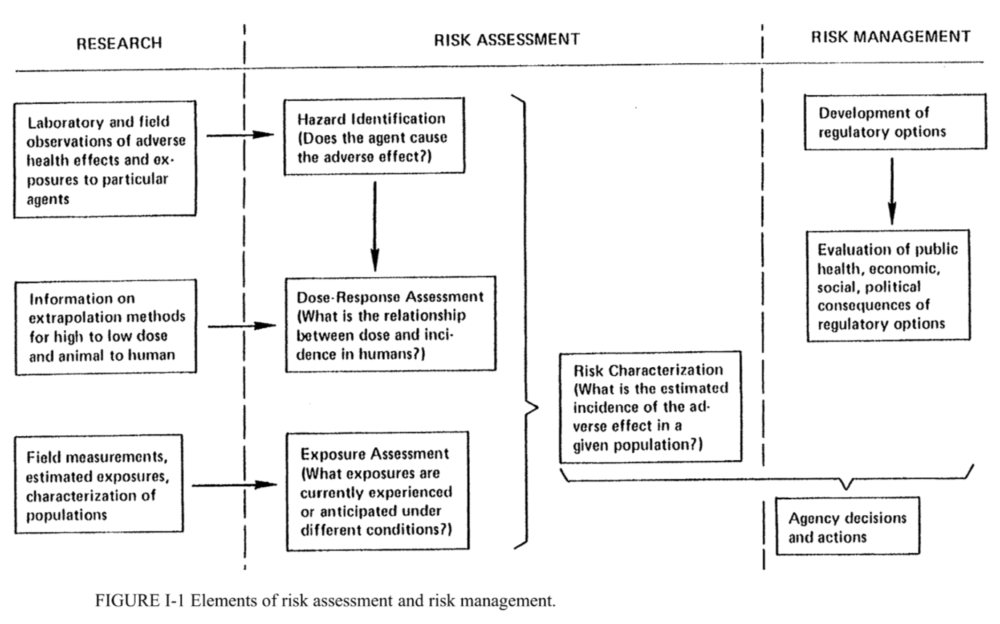
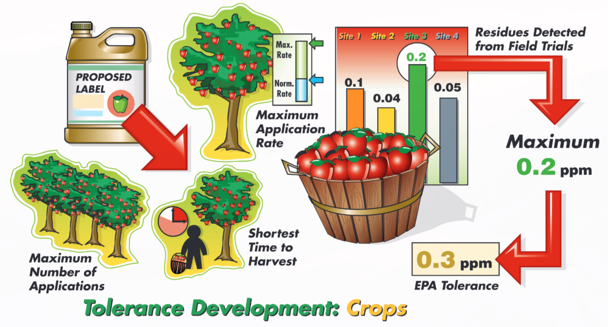
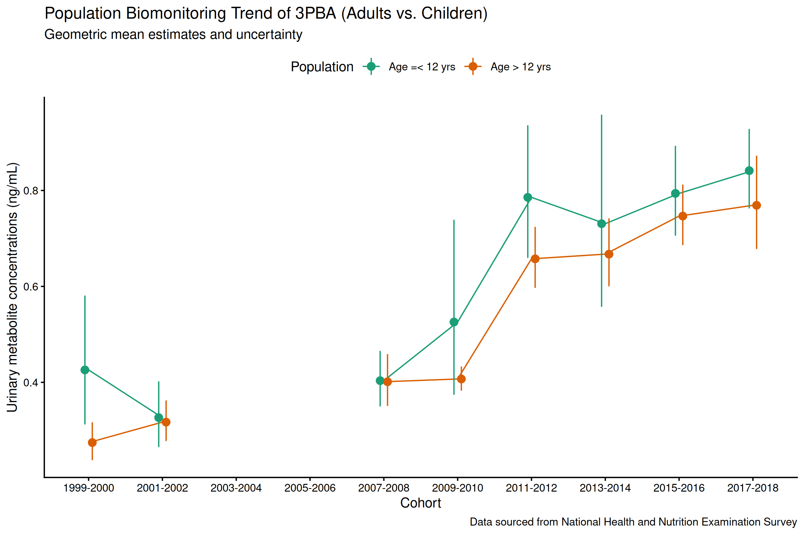
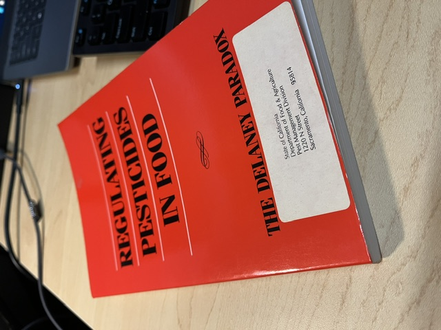

## 30 Years of the Foot Quality Protection Act
#### Pesticide Regulation & Dietary Risk Assessment

Nan-Hung Hsieh, Ph.D.
Sep. 29, 2026

 

  
The views expressed in this presentation are those of the author and do not reflect the views or policies of the California Department of Pesticide Regulation.

 

---

# About

California Environmental Protection Agency

🔻🔻🔻

|- Department of Pesticide Regulation

|--- Registration and Evaluation Division

|----- **Human Health Assessment Branch**

---

# Today’s Topics

 

🪳 An **evolution** in pesticide regulation

📜 A **law** for regulated pesticide residue in food

⚖️ An **appraoch** for pesticide exposure assessment

---

### What Is a Pesticide?

The term "pesticide" means 

- any substance or mixture of substances intended for 

    - preventing, destroying, repelling, or mitigating any pest.

    - use as a plant regulator, defoliant, or desiccant

- any nitrogen stabilizer

<strong>
🪳Insecticides - 🌿Herbcides - 🍄Fungicides - 🐀Rodenticides 
</strong>

<!--
_footer: Source: [Section 2(u) of the Federal Insecticide, Fungicide, and Rodenticide Act](https://www.govinfo.gov/content/pkg/USCODE-2013-title7/html/USCODE-2013-title7-chap6-subchapII-sec136.htm)
-->

---

### First Pesticide 

California’s first law, passed in 1901, was concerned only with preventing consumer fraud in sales of Paris green. 

 

### First Law

Until 1910, Congress passed the first federal law, **Federal Insecticide Act**, to regulate its sales. 

<!--
_footer: Image: [Environ. Health Perspect. (2012) 120 (4): 487–493.](https://pubs.acs.org/evhpaz/article/120/4/487/5241654/The-Greening-of-Pesticide-Environment-Interactions)  
-->

---

## 1906

📕	_The Jungle_ published

🏛️	**Food and Drug Administration** formed

📜	Pure Food and Drug Act

📜	Meat Inspection Act

_cover.jpg)

<!--
_footer: Source: [Theodore Roosevelt Presidential library](https://www.trlibrary.com/)
-->

---

<!--
_footer: Source: [A Guide to Pesticide Regulation in California](https://www.cdpr.ca.gov/wp-content/uploads/2024/08/guidance.pdf)
-->

## First Standard

🍐 **1919** — Boston inspector finds arsenic dust on pears

🍎 **1925** — British illnesses linked to American apple imports

⚖️ **1927** — First federal **tolerances** set for arsenic on apples & pears

---

## 1938

📜 President Franklin Roosevelt signed **Federal Food, Drug, and Cosmetic Act (FFDCA)**. 

The Food and Drug Administration has the authority to set food **"standards"**.

<!--
_footer: Image: [FDA History](https://www.fda.gov/about-fda/changes-science-law-and-regulatory-authorities/part-ii-1938-food-drug-cosmetic-act)   
-->

---

## 1947

📜 **Federal Insecticide, Fungicide, and Rodenticide Act (FIFRA)** was established. 

The U.S. Department of Agriculture (USDA) was required to ensure the "quality and effectiveness" of products.

<!--
_footer: Image: [Science History Institute](https://digital.sciencehistory.org/works/1831ck18w)   
-->

---

## 1970

>  The official birthday of EPA is December 2, 1970 ... But pollution alone does not an agency make. Ideas are needed--better yet a whole world view--and many environmental ideas first crystallized in 1962.

<!--
_footer: Source: [EPA Journal - November 1985](https://www.epa.gov/archive/epa/aboutepa/birth-epa.html); Image: [National Women’s History Museum ](https://www.womenshistory.org/education-resources/biographies/rachel-carson)  
-->

---

## 1972

Congress amended the FIFRA, requiring EPA to measure

-  every pesticide's **"risks"** to man and environement against its potential benefits.

and

- any human **"dietary risk"** from residues that result from use of a pesticide in or on any food inconsistent with the standard under section 408 of the FFDCA.

---

## 1983

<!--
_footer: Source: [Risk Assessment in the Federal Government: Managing the Process](https://www.nationalacademies.org/publications/366)   
-->

---

<!--
_footer: Source: [CBS 60 Minutes segment 'A' Is for Apple"](https://www.youtube.com/watch?v=ebRgPClVPr0)   
-->

---

#### Food Additives Amendment of 1958 (Delaney Clause)

 

# ☠️ Toxic pesticide ✅

#  vs
 
# ☣️ Carcinogenic pesticide ❌

---

## 1996

 

#### FIFRA

Registration
Labeling

#### FFDCA

Tolerance

🔻🔻🔻
    <h4>Food Quality Protection Act (FQPA)</h4>
    
Advanced Risk Assessment

---

# FQPA

FQPA requires EPA to find **"a reasonable certainty of no harm"**, including

- **Aggregate** risk — food, water, air, and other sources

- **Cumulative** risk — chemicals sharing a common mechanism of toxicity

- Extra protection for **infants and children**

---

## Uncertainty Factor ✖️ Safety Factor

 

#### 👨 Reference dose

$RfD=\frac{NOAEL}{UF_{inter}\times UF_{intra} \times{UF_{other}}}$

#### 👶 Population adjusted dose

$PAD=\frac{RfD}{SF}$

 

RfD & PAD can build from No observed adverse effect level (NOAEL) or Lowest observed adverse effect level (LOAEL)

<!--
_footer: Source: [US EPA - Determination of the Appropriate FQPA Safety Factor(s) in Tolerance Reassessment](https://www.epa.gov/sites/default/files/2015-07/documents/determ.pdf)   
-->

---

<!--
_footer: Source: [Pesticides and Human Health Risk Assessment, PPP-48](https://www.extension.purdue.edu/extmedia/PPP/PPP-48.pdf)
-->

---

## Residue Monitoring

🇺🇸 US FDA Residue Monitoring Program (1987–)

🇺🇸 USDA Pesticide Data Program (1991–)

🐻 CDPR California Pesticide Residue Monitoring Program (2003–)

---

## USDA Pesticide Data Program

- For **consumer exposure assessment only**

  - Focuses on pesticides used on the selected commodities, including pesticides without U.S. tolerances but used abroad on imported products.

  - Samples are taken closer to the point of consumer purchase and are prepared the way consumers use them.

  - Laboratories focus on detecting very low pesticide residue levels

<!--
_footer: Source: [PDP Databases and Annual Summaries](https://www.ams.usda.gov/datasets/pdp/pdpdata)
-->

---

## US FDA Residue Monitoring Program

- Enforces **tolerances** on imported & domestic products

- Targeted sampling
    - consumption frequency 
    - violation history 

- Also runs the **Total Diet Study** (~800 contaminants monitored)

<!--
_footer: Source: [Pesticide Residue Monitoring Report and Data for FY 2023](https://www.fda.gov/food/pesticides/pesticide-residue-monitoring-report-and-data-fy-2023)
-->

---

## California Pesticide Residue Monitoring Program

CDPR focuses on sampling high-risk commodities:

- Highly consumed by infants & children
- Treated with Prop 65-listed carcinogens/reproductive toxins
- Reflective of ethnic & socioeconomic consumption patterns
- History of illegal residues (commodity or origin)

<!--
_footer: Source: [California Pesticide Residue Monitoring Annual Report](https://www.cdpr.ca.gov/wp-content/uploads/2025/07/2023california_pesticide_residue_monitoring_program_report.pdf)
-->

---

# Dietary Exposure Assessment

### The basic model

Pesticide Ingested = Residue Concentration x Foods Consumed

**Children vs. Adults**

🧑 60 kg adult, 60 g apple/day → **1 g/kg**

🧒 20 kg child, 60 g apple/day → **3 g/kg**

! Same intake, 3× the exposure per body weight

---

## Acute & Chronic Exposure

**Acute** — extreme exposure scenario

Tier 1: Tolerance

Tier 2: Max detect

 

**Chronic** — mean consumption × mean residue

Tier 3: Mean or ½ LOD

---

## Food Consumption Database

🍕 **Continuing Survey of Food Intakes by Individuals (CSFII, USDA)**  
1989–91, 1994–96, 1998

🍕 **What We Eat In America (WWEIA, CDC)**   
1999–

🧀 🍅 **Food Commodity Intake Database (FCID, EPA)** 
Convert reported food consumption into food commodity intakes

---

## Exposure Assessment

**Deterministic** 

— regulatory tolerance decisions

**Stochastic** 

— exposure distribution, biomonitoring comparison

Neither is "more correct" — the tiered framework matches refinement to the decision

<!--
_footer: DEEM-FCID -Dietary Exposure Evaluation Model - Food Commodity Intake Database   DEEM-FCID -Dietary Exposure Evaluation Model - Food Commodity Intake Database
-->

---

## Exposure Models

**Deterministic**

- DEEM-FCID — regulatory workhorse for dietary assessment used by both EPA and CDPR

**Stochastic** 

- SHEDS — simulates a population of individuals (activity, body weight, diet, etc.,)

---

## Take Away

🪳 **Evolution** — from quality assurance to **safety** assurance

📜 **Law** — a health risk-centric framework to protect **children**

⚖️ **Approach** — integration of **data** and **model** 

---

## Take Away

🪳 Evolution — from quality assurance to safety assurance

📜 Law — health risk-centric framework to protect children

⚖️ Approach — integration of data and model 

 

<h1>Have we done well?</h1>

---

---

## Thank You

Questions?

